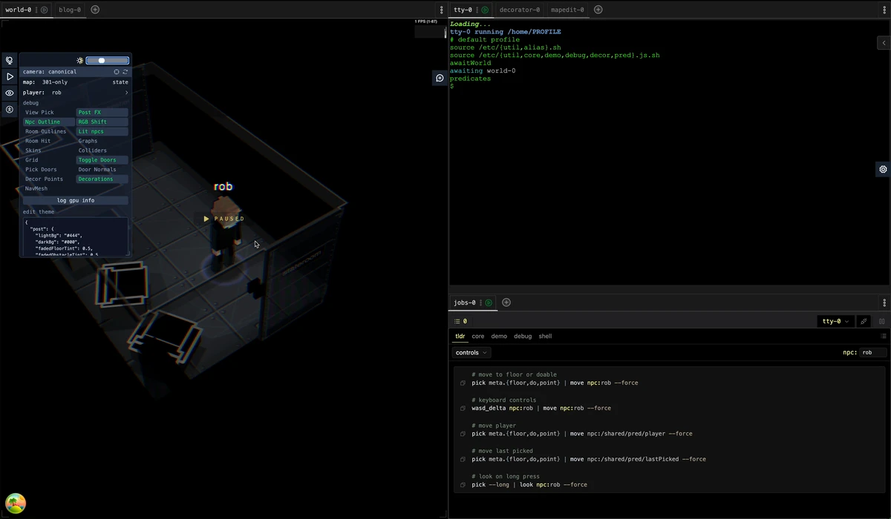

# npc-cli



*Moving the player and spawning npcs in [Geomorph 301](https://travellerrpgblog.blogspot.com/2020/07/starship-geomorphs-20.html) using an in-browser shell.*

A pnpm monorepo vite react app hosting tabbed uis:
- **World** is a 3D world built using three.js WebGPU and react three fiber
- **Jsh** is a xterm.js shell around JavaScript
- **MapEdit** is an SVG style editor sub-symbols and maps
- **Decorator** is for placing dynamic decor.

## Quick start

Needs Node 24 (see `.nvmrc`) and [pnpm](https://pnpm.io/installation).

```sh
pnpm install         # also points git at .githooks/
pnpm approve-builds  # allow skia-canvas' native build
pnpm dev             # http://localhost:5173
```

On a phone, `pnpm dev-hotspot` serves on your network: find your address with `ipconfig getifaddr en0` and open `http://<address>:5173`.

Some scripts need extra tools (pngquant, ImageMagick, Go/TinyGo) — see [docs/tooling.md](docs/tooling.md).

## Layout

| Package | What it is |
|---|---|
| `packages/app` | Vite app entry, and the public assets: sheets, symbols, maps, decor, skins |
| `packages/ui/world` | The 3D world: camera, npcs, navigation, lighting, floor |
| `packages/ui/*` | The other UIs: `jsh`, `map-edit`, `decorator`, `tabs`, `jobs`, `blog`, … |
| `packages/cli` | The shell behind Jsh: tty, processes, and the `jsh` world commands |
| `packages/media` | Static asset keys, symbol metadata, source images e.g. the geomorphs |
| `packages/util` | Shared geometry (`Mat`, `Vect`, `Rect`), services, TSL helpers |
| `packages/parse-sh` | Shell parser, Go compiled to WASM |
| `packages/ui-sdk`, `ui-registry` | How a UI is defined, registered and persisted |
| `scripts` | Vite plugins, the MapEdit save API, asset generation |

## Scripts

| Command | When |
|---|---|
| `pnpm dev` / `pnpm build` / `pnpm preview` | Run, build, or serve the build |
| `pnpm typecheck` | Type-check every package (`tsgo -b`) |
| `pnpm check` | Lint and format check (Biome) |
| `pnpm gen-assets-json` | Rebuild `assets.json` from MapEdit files — runs by itself on save in dev; `--force` recomputes symbol stratification |
| `pnpm gen-starship-sheets` | Rebuild the obstacle spritesheet after changing obstacles — or the **obstacles** button in the World menu |
| `pnpm gen-decor-sheets` / `pnpm gen-skin-sheets` | Rebuild the decor or skin spritesheets |
| `pnpm gen:ui` / `pnpm gen-pkg` | Scaffold a new UI or package |

## Git hooks

Hooks live in `.githooks/`; `pnpm install` enables them via the `prepare` script.

| Hook | What it does |
|---|---|
| `pre-commit` | Runs `pnpm gen-starship-sheets` and stages its output |
| `pre-push` | Runs `pnpm gen-starship-sheets` |

## Docs

| Doc | About |
|---|---|
| [floor](docs/floor.md) | How the floor is drawn, and `deckConfig` |
| [starship-sheets](docs/starship-sheets.md) | Obstacle spritesheets, masks, and MapEdit `dup` |
| [map-edit](docs/map-edit.md) | Where a saved MapEdit file goes |
| [decorator](docs/decorator.md) | The Decorator panel and runtime decor |
| [workers](docs/workers.md) | The physics and nav web workers |
| [web-rtc-worlds](docs/web-rtc-worlds.md) | One World joining another over WebRTC |
| [navcat-patch](docs/navcat-patch.md) | The patched crowd/navmesh library |
| [npc-outlines](docs/npc-outlines.md) | The border drawn round npcs |
| [page-load-perf](docs/page-load-perf.md) | Page load measurements |
| [screen-slideshows](docs/screen-slideshows.md) | Turning a screen recording into a README slideshow |
| [tooling](docs/tooling.md) | Optional tools, and which scripts need them |
| [gotchas](docs/gotchas.md) | Things that have bitten before |
| [blockbench](docs/blockbench.md) | Modelling npcs in Blockbench |
